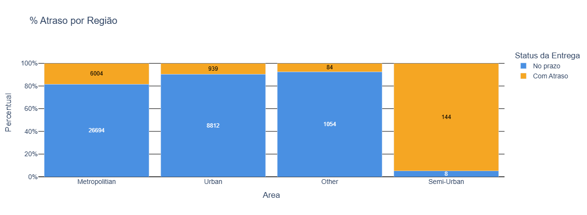
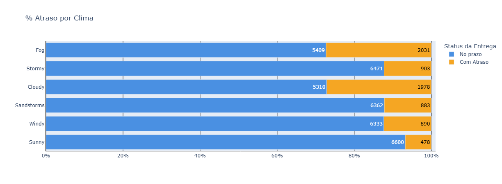
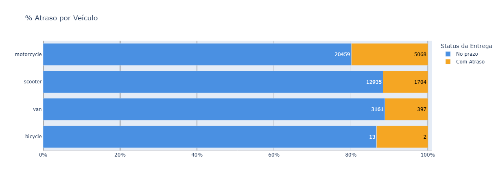
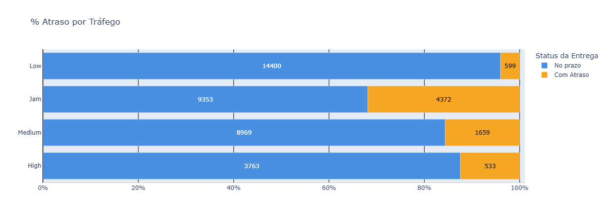
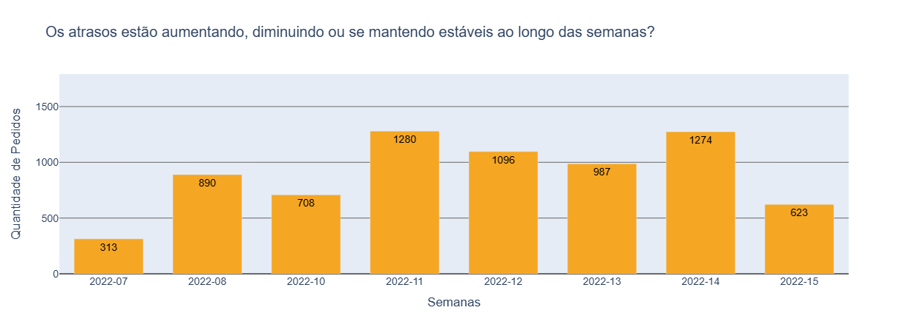
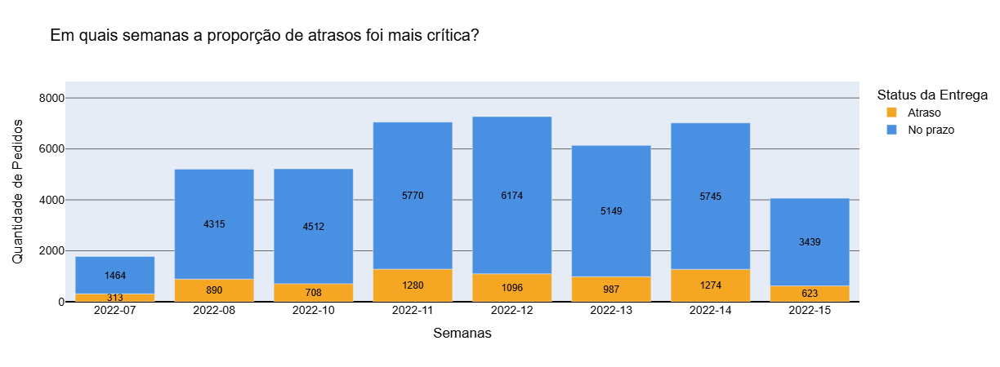
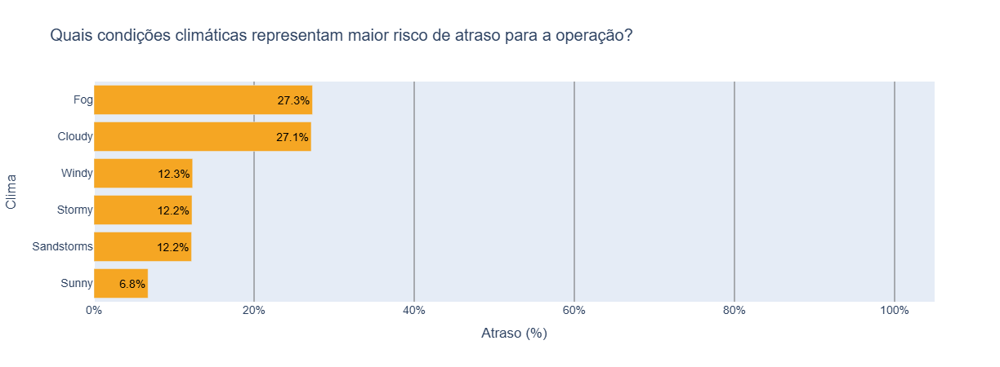
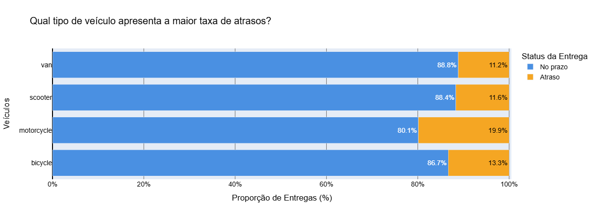
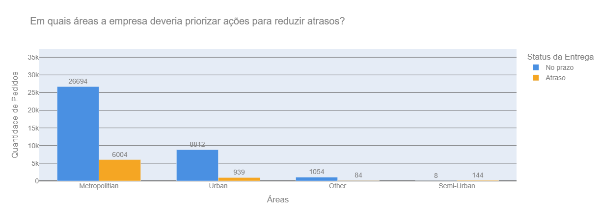

# Análise de Entregas da Amazon

## 1. Problema de Negócio
A empresa enfrenta um aumento no número de entregas realizadas fora do prazo, o que tem gerado insatisfação dos clientes, aumento de reclamações e risco de perda de confiança na marca.

O principal desafio do negócio é entender por que os atrasos acontecem, identificar onde eles se concentram e gerar informações claras que apoiem decisões operacionais para reduzir a taxa de atraso e melhorar a previsibilidade das entregas.

## 2. Contexto
A operação de entregas envolve diferentes variáveis que impactam diretamente o prazo, como:
- condições climáticas,
- tráfego,
- tipo de veículo utilizado,
- área de entrega,
- perfil do entregador,
- categoria do produto.

A empresa já possui os dados operacionais registrados em uma base histórica, mas não utiliza essas informações de forma analítica para apoiar decisões estratégicas.
O objetivo deste projeto é transformar dados brutos de entregas em insights acionáveis, utilizando análises descritivas e visualizações simples, capazes de serem compreendidas por áreas como Operação, Logística e Gestão.

## 3. Premissas da análise
Para a realização da análise, foram adotadas as seguintes premissas:
- O status de entrega (Delivery_Status) é considerado a fonte oficial para identificar atrasos (delay) e entregas no prazo (ontime).
- O tempo de entrega (Delivery_Time) está representado em minutos.
- Registros com valores ausentes em colunas como tráfego ou clima foram tratados como “informação desconhecida” ou excluídos quando necessário.
- As análises foram feitas com foco em identificação de padrões, não em causalidade estatística.
- O período analisado representa uma amostra válida do comportamento operacional recente da empresa.

## 4. Estratégia da solução
A estratégia adotada seguiu uma abordagem estruturada de análise de dados:

### 4.1. Entendimento do problema de negócio
Identificar claramente o que significa atraso e por que ele é prejudicial para a empresa.

### 4.2. Exploração e organização dos dados
Compreensão das colunas, tipos de dados e possíveis inconsistências.

- Descrição das colunas da Base de dados:
    - **Order_ID** - Identificador único do pedido
    - **Agent_Age** - idade do entregador (anos).
    - **Agent_Rating** - avaliação média do entregador (ex.: 4,7).
    - **Store_Latitude** - latitude do ponto de origem.
    - **Store_Longitude** - Store_Longitude	longitude do ponto de origem.
    - **Drop_Latitude** - latitude do destino.
    - **Drop_Longitude** - longitude do destino.
    - **Order_Date** - data do pedido.
    - **Order_Year** - ano/mês do pedido.
    - **Order_Week** - semana do pedido (ex.: “2022-12”).
    - **Order_Time** - horário em que o pedido foi feito.
    - **Pickup_Time** - horário em que o pedido foi coletado para entrega.
    - **Weather** - condição climática (ex.: Sunny, Fog, Stormy…).
    - **Traffic** - condição de tráfego (Low, Medium, High, Jam).
    - **Vehicle** - Vehicle	tipo de veículo do entregador (motorcycle, scooter, van, bicycle).
    - **Area** - tipo de área (Metropolitan, Urban, Semi-Urban, Other).
    - **Delivery_Time** - tempo total de entrega.
    - **Delivery_Status** - status da entrega do pedido.
    - **Category** - categoria do produto (ex.: Electronics, Books, Grocery etc.).

### 4.3. Análise descritiva
Cálculo de métricas como quantidade de entregas, taxa de atraso e estatísticas de tempo de entrega.

### 4.4. Segmentação dos atrasos
Avaliação dos atrasos por diferentes dimensões:
- tempo,
- área,
- clima,
- tráfego,
- veículo,
- categoria de produto.

### 4.5. Visualização dos dados
Criação de gráficos claros para facilitar a interpretação dos resultados e comunicação com o negócio.

## 5. Insights da Análise
A análise dos dados permitiu identificar padrões relevantes, como:
- O tempo médio de entrega é de 125 min (2h) com desvio-padrão de 52 min (2h). A entrega mais rápida aconteceu em 10 min e a mais lenta em 270 min (4,5h).
- A área “Semi-Urban” é a única área que apresenta mais atrasos do que entregas sem atraso.
- Os atrasos aumentam em dias nublados e com neblina, e diminuem em dias de sol.

  
  

- Veículos como motocicletas apresentam maior taxa de entrega atrasada em relação aos outros meios de transporte.
- O nível de tráfego forte ( Jam ), apresenta mais atrasos.

  
  

#### Além disso, foram respondidas as seguintes perguntas de negócio:
- Os atrasos estão aumentando, diminuindo ou se mantendo estáveis ao longo das semanas?

  

- Em quais semanas a proporção de atrasos foi mais crítica?

  

- Quais condições climáticas representam maior risco de atraso para a operação?

  

- Qual tipo de veículo apresenta a maior taxa de atrasos?

  

- Em quais áreas a empresa deveria priorizar ações para reduzir atrasos?

  

## 6. Resultados
Como resultado do projeto, as iniciativas são:
- Aprofundar o entendimento do motivo pelo qual a área “Semi-Urban” tem os maiores volumes de atraso.
- Mudar o tipo de veículo de entrega para a área “Semi-Urban”
- Diagnóstico visual dos pontos mais críticos da operação.
- Base analítica para priorizar ações corretivas.
- Relatórios e gráficos que podem ser utilizados por áreas não técnicas.

- Acesse o relatório do projeto: [Dashboard](https://analyisisamazondelivery.streamlit.app/)

Além disso, o projeto demonstra como a análise de dados pode transformar dados operacionais em decisões práticas, mesmo utilizando técnicas simples.

## 7. Próximos passos
Com base nos resultados obtidos, os próximos passos recomendados são:
- Criar planos de ação específicos para áreas, veículos e condições mais críticas.
- Monitorar a taxa de atraso de forma contínua por meio de dashboards.
- Avaliar treinamentos ou ajustes operacionais para entregadores e rotas.
- Integrar análises preditivas para antecipar riscos de atraso.
- Aprofundar a análise com dados adicionais, como distância percorrida ou horário de pico.
